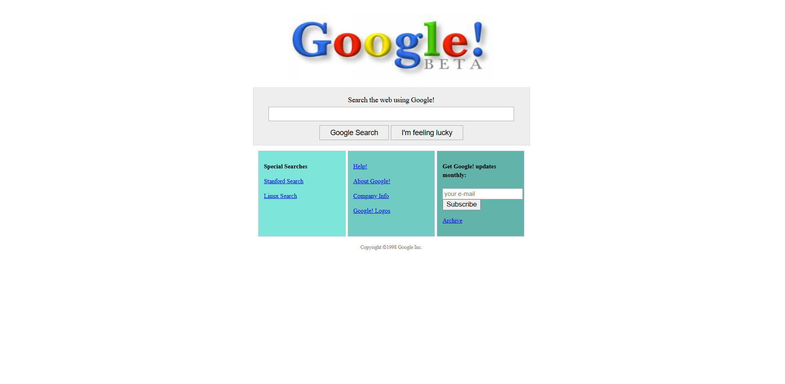

# Google Hauptseite Klon



Dieses Projekt ist eine einfache HTML- und CSS-Nachbildung des klassischen Google-Hauptseiten-Layouts, inspiriert vom alten Google-Beta-Design. Es dient als Übungsprojekt für HTML/CSS-Layout-Fähigkeiten und responsives Webdesign und wurde im Rahmen des NewMind AI Fullstack Bootcamps erstellt.

## Funktionen
- Replik der klassischen Google-Hauptseite
- HTML-Struktur für das Seitenlayout
- CSS-Styling für Layout und Farbschema
- Schaltflächen- und Link-Funktionalitäten

## Installation
1. Klonen Sie das Repository:
   ```bash
   git clone https://github.com/yourusername/google-main-page-clone.git
2.Öffnen Sie index.html in Ihrem Browser, um die Seite anzuzeigen.

## Nutzung
Dieses Projekt kann als Grundlage für HTML/CSS-Übungen verwendet werden oder um das Design der klassischen Google-Seitenlayout zu erkunden.


# Google Main Page Clone


This project is a simple HTML and CSS recreation of the classic Google main page layout, inspired by the old Google Beta design. It serves as a practice project for HTML/CSS layout skills and responsive web design, created as part of the NewMind AI Fullstack Bootcamp.

## Features
- Replica of the classic Google main page
- HTML structure for page layout
- CSS styling for layout and color scheme
- Button and link functionalities

## Installation
1. Clone the repository:
   ```bash
   git clone https://github.com/yourusername/google-main-page-clone.git
2. Open index.html in your browser to view the page.

## Usage
Feel free to use this project as a foundation for practicing HTML/CSS or to explore how the classic Google page layout was designed.
